[](https://classroom.github.com/a/90Mprfp5)
# Network Programming - Final Project [G04]

## Anggota Kelompok
| Nama                                | NRP        | Kelas |
| ---                                 | ---        | ----- |
| Jalu Cahyo Senodiputro              | 5025241155 | C     |
| Erlangga Rizqi Dwi Raswanto         | 5025241179 | C     |
| Nabil Irawan                        | 5025241231 | C     |

## Link Youtube (Unlisted)
Link ditaruh di bawah ini
```

```

## Penjelasan Program
Struktur Komponen & Peran Sistem (Architecture Roles)

Aplikasi NetCourier dibagi menjadi beberapa komponen utama yang memiliki peran dan tanggung jawab spesifik dalam menangani alur web dan backend:

### 1. Web Client (Frontend / Browser UI)
*   **Peran:** Menyajikan antarmuka visual kepada pengguna dan menangani interaksi langsung (click events, form submissions, file selection, XHR slicing).
*   **Komponen File:**
    *   [web_ui/index.html](web_ui/index.html): Kerangka tampilan Single Page Application (SPA), modal chat, transfer list, dan reaction panels.
    *   [web_ui/app.js](web_ui/app.js): Logika pengontrol UI (event listeners, dynamic rendering, file slicing/upload loop, polling `/api/events` menggunakan Server-Sent Events / Long-polling).
*   **Cara Kerja:**
    *   Berjalan di peramban web client.
    *   Mengirim request HTTP REST ke Web API Server.
    *   Menerima broadcast real-time (pesan baru, reaksi emoji, status mengetik) dari event stream HTTP.

### 2. Web API Server (HTTP-to-TCP Bridge)
*   **Peran:** Bertindak sebagai jembatan penerjemah yang mengubah panggilan REST API (HTTP) dari browser menjadi paket protokol TCP biner, serta meneruskan respon TCP server kembali ke browser.
*   **Komponen File:**
    *   [web_api/server.py](web_api/server.py): Server HTTP kustom berkinerja tinggi yang menangani REST routing, manajemen sesi `WebSession` yang melacak socket TCP persisten, dan pengiriman event streaming.
    *   [client/main.py](client/main.py): Entry point (launcher) untuk memulai server Web API di port 8080.
*   **Cara Kerja:**
    *   Menerima HTTP Request -> Mencari `WebSession` aktif -> Mengambil raw socket -> Mengirim paket TCP biner terbingkai length-prefixed.
    *   Melacak koneksi persistent Gateway (`session.gateway_conn`) dan Process Server (`session.room_conn`).
    *   Menggunakan thread-safe `write_lock` pada socket TCP untuk mencegah korupsi data stream selama unggahan potongan biner (chunks) paralel.

### 3. Gateway Server (Auth & Global Directory)
*   **Peran:** Mengkoordinasikan status sistem secara global (autentikasi, sesi aktif, perutean pesan privat/PM, pembuatan room, dan beban kerja server).
*   **Komponen File:**
    *   [gateway/main.py](gateway/main.py): Server utama yang membuka socket client-facing (port 9000) dan backend-facing (port 9001).
    *   [gateway/auth_service.py](gateway/auth_service.py): Melakukan pendaftaran dan verifikasi login menggunakan enkripsi PBKDF2.
    *   [gateway/presence_service.py](gateway/presence_service.py): Mencatat status user (online/offline) di database SQLite.
    *   [gateway/load_balancer.py](gateway/load_balancer.py): Memilih server pemroses dengan beban paling rendah saat room dibuat.
*   **Cara Kerja:**
    *   Berjalan sebagai server TCP socket mandiri.
    *   Menerima pendaftaran detak jantung (*heartbeat*) Process Server dan melacak ketersediaan mereka.
    *   Mengatur perutean data global terpusat.

### 4. Process Server (Chat Room & File Transfer)
*   **Peran:** Menangani semua fungsionalitas obrolan di dalam room chat dan proses transfer berkas (upload/download).
*   **Komponen File:**
    *   [server/main.py](server/main.py): Server room mandiri yang menangani multi-klien via threads/socket select, broadcast chat room, indikator mengetik, reaksi emoji, dan chunked upload/download.
*   **Cara Kerja:**
    *   Menghubungkan socket client yang sudah terautentikasi (melalui koordinasi room location dari Gateway).
    *   Menyimpan progress upload biner (`self.transfer_progress`) di memori dan menyimpannya secara bertahap ke SQLite DB.
    *   Menyimpan file fisik biner langsung ke folder penyimpanan lokal per-room (`data/` folder).

## Screenshot Hasil
## 1. Fitur Autentikasi (Registrasi & Login)

NetCourier menyediakan mekanisme pendaftaran akun baru secara langsung dan login dengan perlindungan kata sandi menggunakan hashing aman PBKDF2 di sisi Gateway.

### 1.1 Registrasi User Baru
Ketika pengguna belum memiliki akun, mereka dapat mendaftarkan username dan password. Hashing PBKDF2 akan dilakukan di sisi Gateway sebelum disimpan di database SQLite.
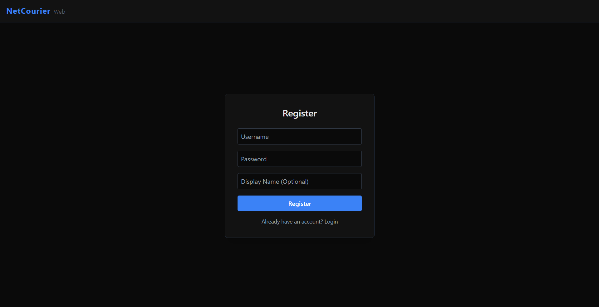
Registration successful
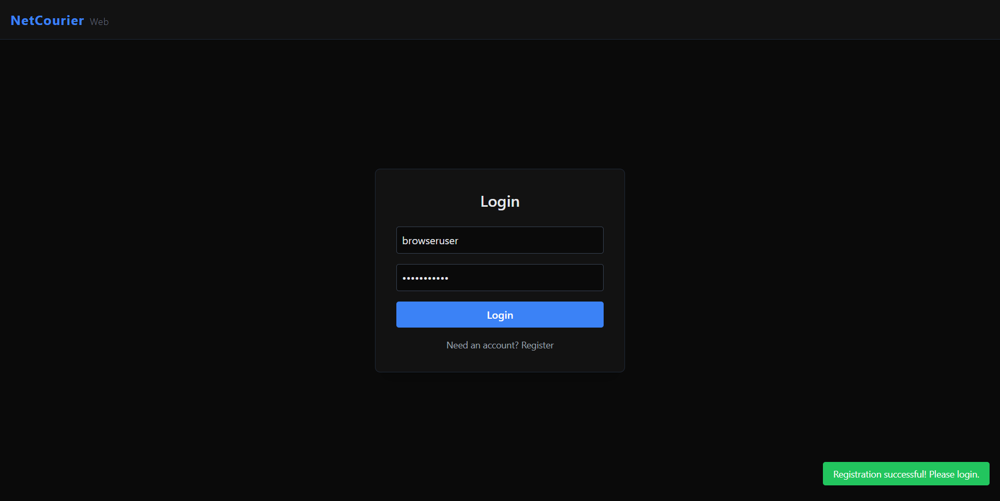
### 1.2 Halaman Login
Setelah terdaftar, pengguna dapat masuk dengan kredensial mereka. Sesi login akan menghasilkan sebuah `session_token` unik yang digunakan untuk mengautentikasi setiap transaksi data selanjutnya.
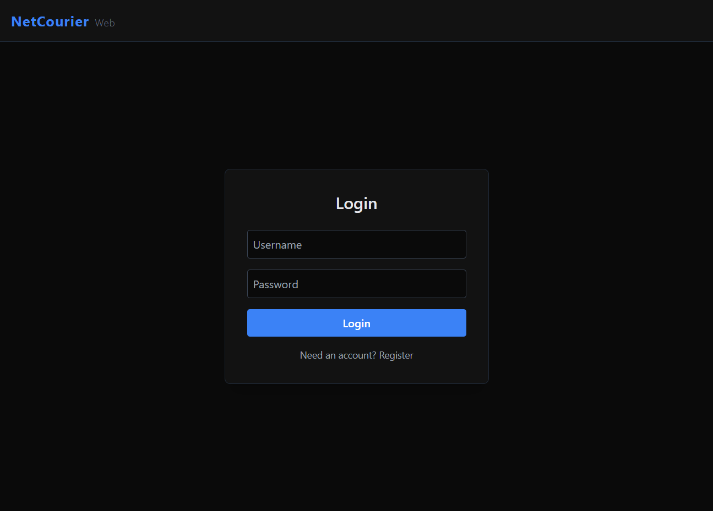

### 1.3 Login Berhasil
Ketika kredensial valid, Gateway membalas dengan status `LOGIN_OK`, dan pengguna akan diarahkan ke Dashboard utama.
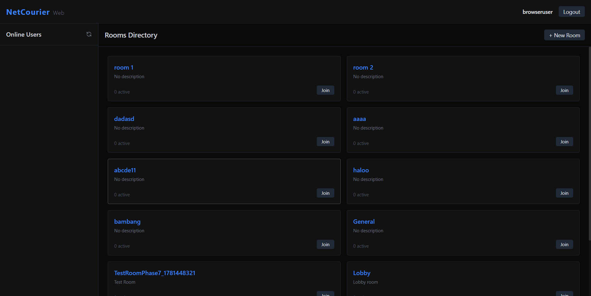

---

## 2. Dashboard Utama & Presensi (Online Users)

Setelah login, pengguna masuk ke dashboard utama. Di sini, pengguna dapat melihat status kehadiran pengguna lain secara real-time dan daftar room obrolan yang aktif.

*   **Daftar User Online:** Menampilkan siapa saja yang sedang aktif (online) di dalam sistem dengan status dan lokasinya secara dinamis.
*   **Daftar Room:** Menampilkan semua ruang obrolan beserta jumlah anggota aktif yang sedang bergabung.
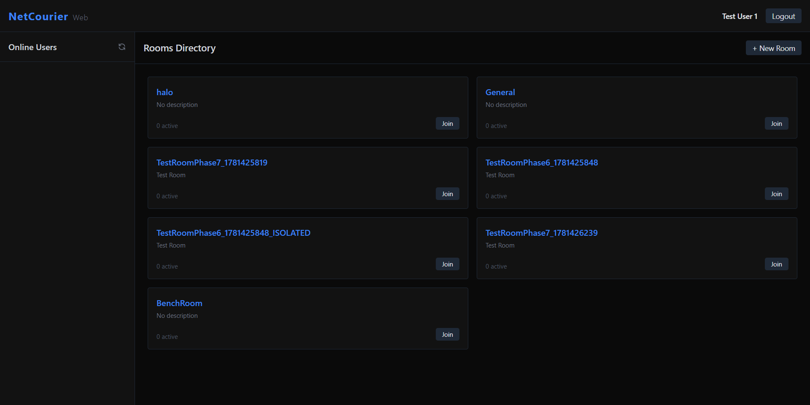

---

## 3. Obrolan Room (Room Chat & System Events)

Fitur room chat berjalan di atas **Process Server (S1/S2)**. Ketika pengguna memilih untuk bergabung ke salah satu room, Gateway akan memberikan lokasi server (IP & Port) melalui prinsip *load balancing* berbasis beban terendah, lalu koneksi TCP Socket ke room server tersebut akan didirikan.

### 3.1 Bergabung ke Room
Berikut tampilan room setelah user berhasil masuk. Sistem menampilkan judul room di bagian atas dan memuat riwayat obrolan (*chat history*) sebelumnya dari database.
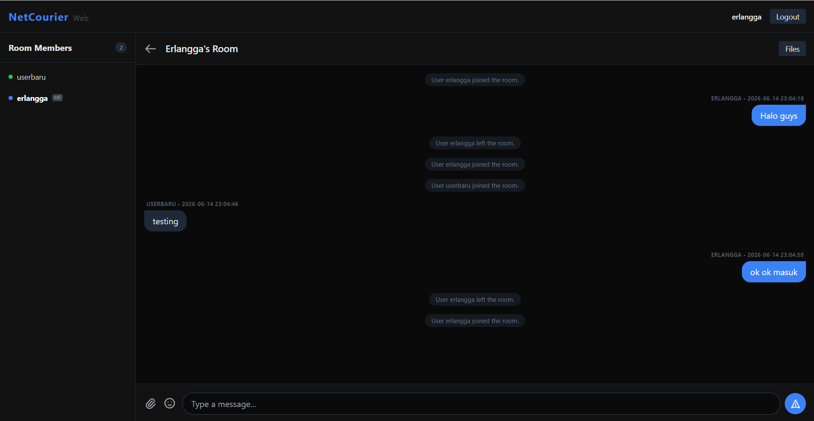

### 3.2 Mengirim Pesan Chat
Pengguna dapat mengetik pesan dan mengirimkannya. Pesan dikirim menggunakan paket `ROOM_CHAT_SEND` dan disebarkan ke semua anggota room secara real-time via `ROOM_CHAT_BROADCAST`.
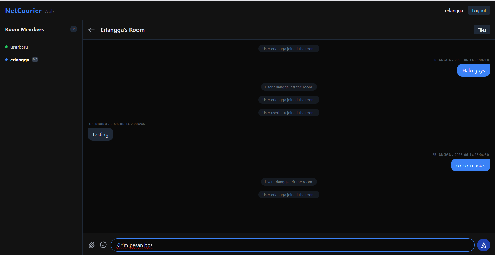

---

## 4. Emoji Reactions & Typing Indicator

Untuk meningkatkan interaktivitas room, sistem dilengkapi dengan indikator mengetik dan reaksi emoji pada pesan chat.

### 4.1 Indikator Mengetik (Typing Indicator)
Ketika pengguna mulai mengetik, event `ROOM_TYPING_INDICATOR` dikirim ke server dan disebarkan ke seluruh anggota room sehingga muncul teks "[Username] is typing..." secara dinamis.

### 4.2 Memilih Emoji Reaction
Pengguna dapat mengklik ikon reaksi pada setiap pesan chat bubble untuk memilih emoji (seperti 🔥, 👍, ❤️, 😂).


### 4.3 Tampilan Setelah Reaksi Ditambahkan
Emoji reaksi akan muncul di bawah bubble chat yang bersangkutan dengan jumlah akumulasi klik dan daftar username pemberi reaksi secara dinamis.


---

## 5. Reliable File Transfer (Unggah & Unduh File)

Pengiriman berkas menggunakan protokol *Reliable Chunked Transfer* dengan pembagian file menjadi potongan-potongan kecil (chunks) dan validasi keutuhan file menggunakan **SHA-256 Checksum**.

### 5.1 Unggah Berkas & Progress Bar
Ketika file diunggah melalui tombol input, file akan dipecah menjadi chunks (ukuran dinamis antara 1MB s.d. 16MB berdasarkan ukuran file untuk mencegah port exhaustion). Status bar akan menampilkan persentase progress dan estimasi kecepatan unggah secara langsung.


### 5.2 Unggah File Selesai
Setelah semua chunks berhasil diterima oleh Process Server, server memverifikasi checksum SHA-256 berkas fisik dengan nilai checksum awal. Jika cocok, status berkas diubah menjadi `available` dan kartu file ditampilkan di dalam room chat.
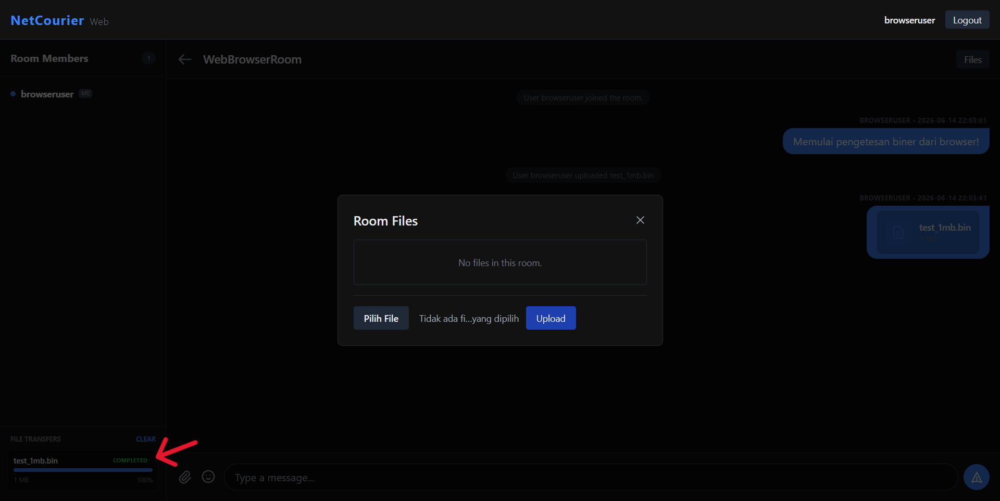

### 5.3 Pengujian Berkas Besar (500MB/1GB) & Kecepatan
Mekanisme dynamic chunk size dan thread-safe write locks memungkinkan transfer berkas besar hingga **1GB** berjalan stabil dengan throughput tinggi (mencapai **113+ MB/s** di browser).
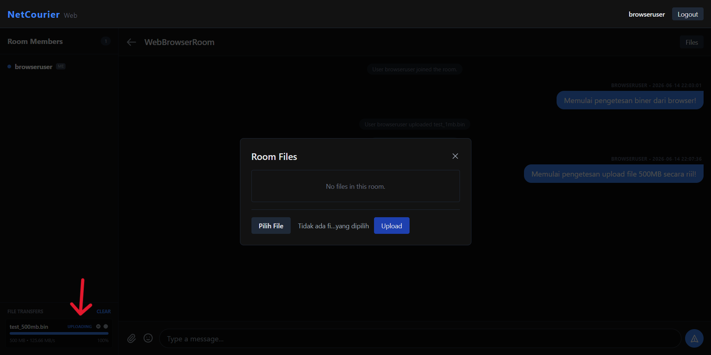
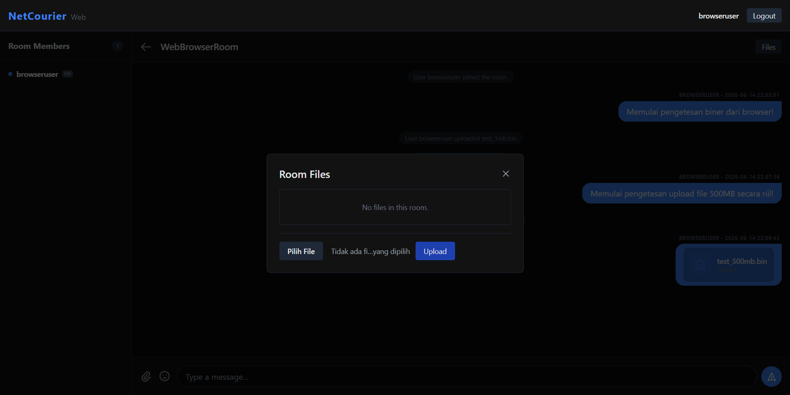

### 5.4 Unduh Berkas (Streaming Chunked HTTP)
Pengguna dapat mengunduh berkas langsung dari bubble chat. Web API Server akan meminta data berkas ke Process Server (`DOWNLOAD_REQUEST`) dan melakukan streaming data chunks tersebut kembali ke browser.

---

## 6. Penghapusan Berkas (File Deletion)

Pengguna dapat menghapus berkas yang telah mereka unggah. Ketika tombol "Delete File" diklik, request `ROOM_DELETE_FILE` dikirim ke server. Server akan menghapus berkas fisik di disk, memperbarui database, dan mengirimkan broadcast `ROOM_DELETE_FILE_BROADCAST` agar kartu file tersebut hilang secara real-time dari layar browser semua anggota room.
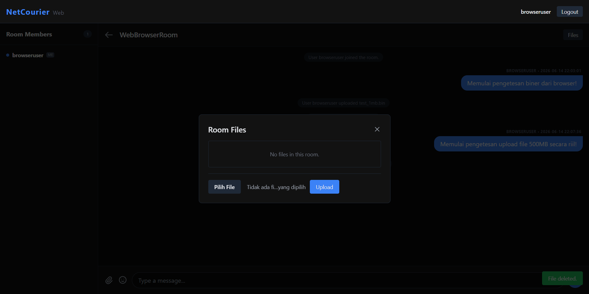
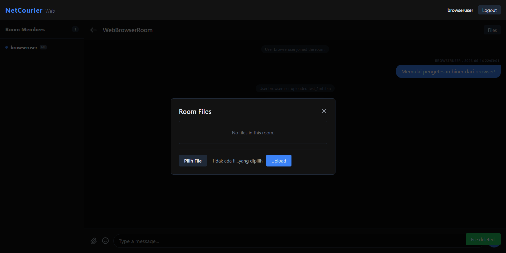

---

## 7. Interaksi Multi-User & Moderasi (Kick User)

NetCourier mendukung interaksi banyak pengguna secara simultan di dalam room chat yang sama, lengkap dengan kendali administrasi oleh pembuat room (*room owner*).

### 7.1 Multi-User Chatting
Interaksi obrolan grup secara real-time antar pengguna yang berbeda di dalam room.
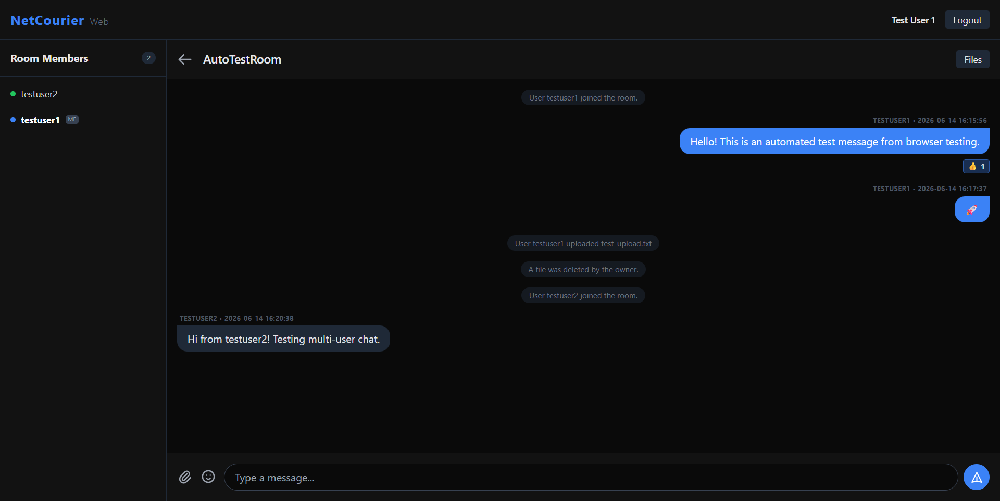

### 7.2 Kick User (Moderasi)
Pembuat room (*room owner*) memiliki wewenang untuk mengeluarkan anggota room yang melanggar aturan. Owner dapat mengklik tombol "Kick" di samping nama anggota pada panel daftar member.
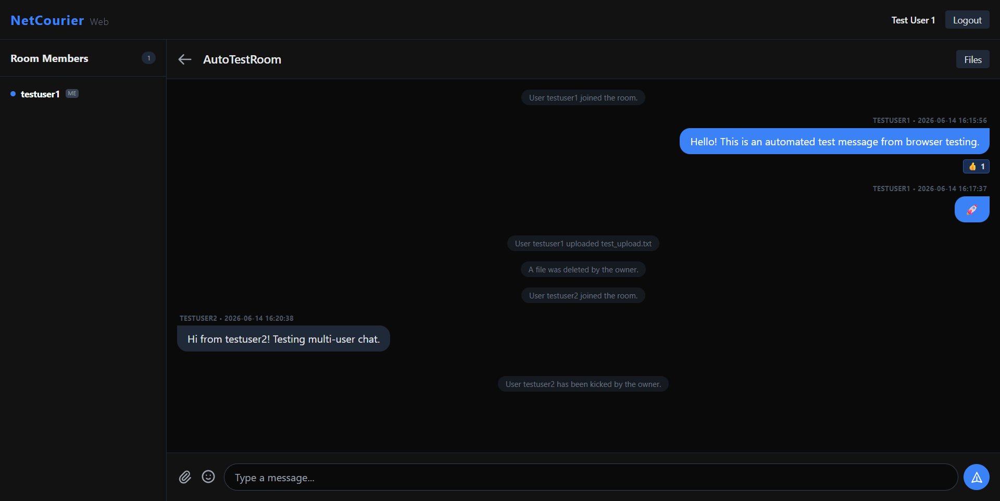

### 7.3 Hasil Setelah User Dikick
Pengguna yang dikick akan langsung dikeluarkan dari room obrolan secara otomatis dan dipaksa kembali ke dashboard utama dengan notifikasi sistem yang sesuai.


