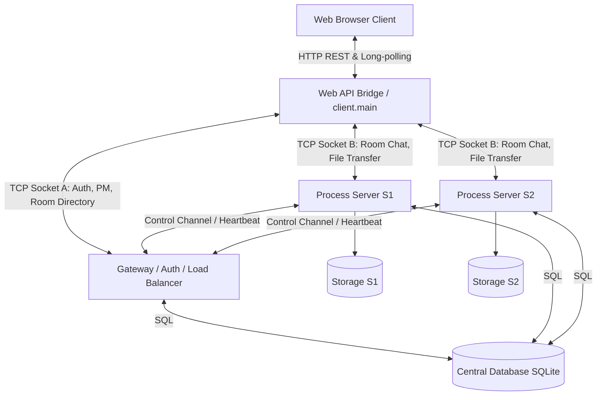
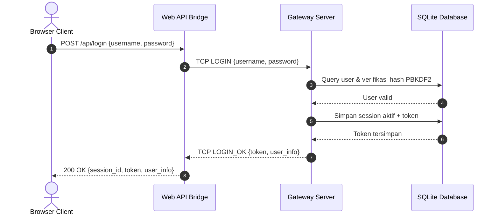
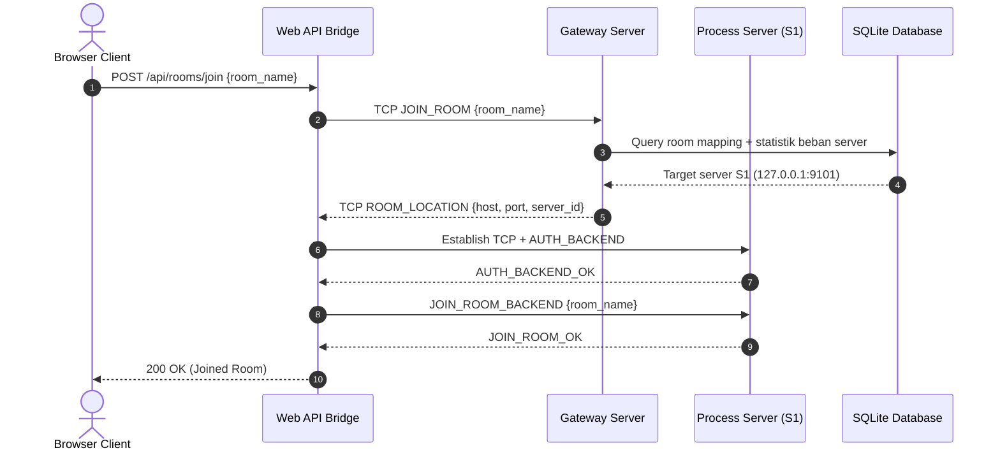
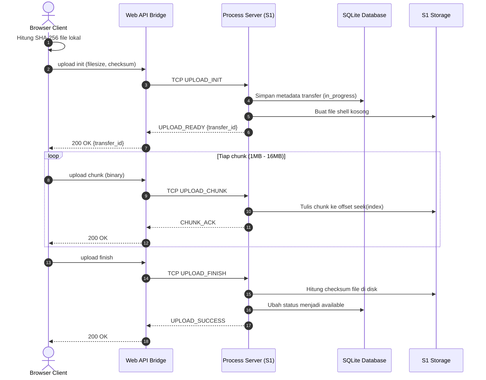
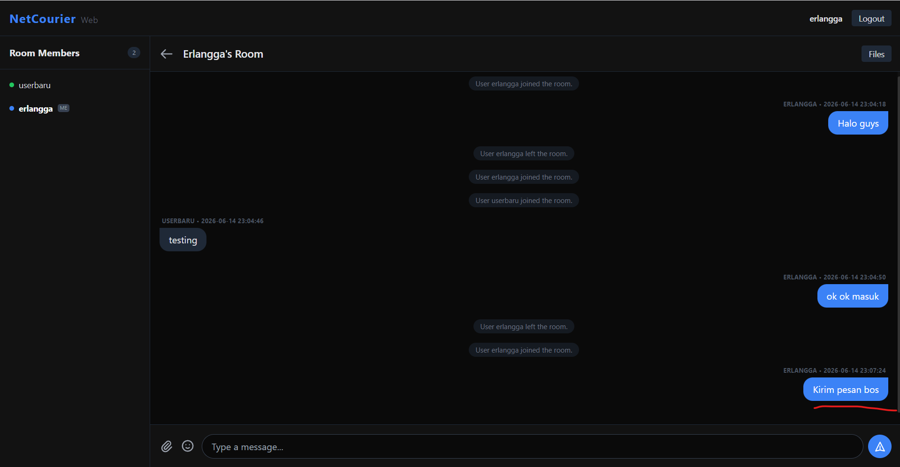

[](https://classroom.github.com/a/90Mprfp5)
# Network Programming - Final Project [G04]

## Anggota Kelompok
| Nama                                | NRP        | Kelas |
| ---                                 | ---        | ----- |
| Jalu Cahyo Senodiputro              | 5025241155 | C     |
| Erlangga Rizqi Dwi Raswanto         | 5025241179 | C     |
| Nabil Irawan                        | 5025241231 | C     |

## Link Youtube (Unlisted)
[Demo Singkat Final Project Pemrograman Jaringan (C) - KEL 11](https://www.youtube.com/watch?v=bgHmax3lRjk)

[](https://www.youtube.com/watch?v=bgHmax3lRjk)

## Penjelasan Program
NetCourier adalah aplikasi multi-chat room terdistribusi yang menggabungkan antarmuka web modern dengan backend TCP kustom. Arsitekturnya dipisah menjadi layanan global (autentikasi, direktori room, presence, private message) dan layanan lokal room (chat broadcast, reaksi, typing indicator, transfer file).

### 1. Tujuan dan Cakupan Sistem
1. Menyediakan chat room real-time multi-user dengan latensi rendah.
2. Mendukung private message (PM) dan status kehadiran pengguna (presence).
3. Menyediakan transfer file besar yang andal dengan mekanisme chunked upload/download dan verifikasi checksum.
4. Menjembatani browser (HTTP) ke backend raw TCP melalui API Bridge, karena browser tidak mendukung raw TCP socket secara langsung.

### 2. Komponen Utama dan Tanggung Jawab
1. **Web Client (Frontend / Browser UI)**
- File utama: [web_ui/index.html](web_ui/index.html), [web_ui/app.js](web_ui/app.js)
- Menangani interaksi pengguna: login, list room, chat, reaction, typing, upload/download.
- Mengirim request REST ke API Bridge dan menerima event real-time melalui endpoint events.

2. **Web API Bridge (HTTP-to-TCP Translator)**
- File utama: [web_api/server.py](web_api/server.py), [client/main.py](client/main.py)
- Menjaga sesi web (`WebSession`) yang menyimpan koneksi TCP persisten ke Gateway dan Process Server.
- Menerjemahkan request HTTP menjadi packet TCP custom length-prefixed dan mengembalikan response ke browser.
- Mengoptimalkan upload biner dengan bypass decode UTF-8 pada endpoint upload chunk.

3. **Gateway Server (Global Coordination Layer)**
- File utama: [gateway/main.py](gateway/main.py), [gateway/auth_service.py](gateway/auth_service.py), [gateway/presence_service.py](gateway/presence_service.py), [gateway/load_balancer.py](gateway/load_balancer.py)
- Mendengarkan dua jalur utama:
  - Client-facing port 9000 (login, room directory, PM, presence).
  - Backend-control port 9001 (registrasi backend server, heartbeat, kontrol cluster).
- Menangani register/login, validasi token, room assignment, dan pemetaan user aktif.
- Menerapkan rate limiting untuk PM dan pembersihan session stale/expired secara periodik.

4. **Process Server (Room Runtime Layer)**
- File utama: [server/main.py](server/main.py)
- Menangani lifecycle room: join/leave, broadcast pesan, reaction, typing indicator, member list, dan kick user.
- Menjalankan transfer file chunked, menyimpan progress transfer, serta timeout cleanup transfer tidak aktif.
- Mengirim heartbeat berkala ke Gateway agar statistik beban server selalu mutakhir.

5. **Database dan Penyimpanan Berkas**
- Database terpusat SQLite: [data/netcourier.db](data/netcourier.db) (dibuat otomatis bila belum ada).
- Inisialisasi skema dilakukan melalui migrasi awal [migrations/001_init.sql](migrations/001_init.sql).
- Berkas transfer disimpan di storage lokal server, sementara metadata dan status transfer disimpan di database.

### 3. Alur End-to-End (Ringkas)
1. User login dari browser melalui endpoint API.
2. API Bridge meneruskan permintaan login ke Gateway melalui TCP packet.
3. Gateway memverifikasi kredensial (PBKDF2), membuat session token, dan menyimpan status online.
4. Saat user join room, Gateway memilih Process Server berdasarkan load balancing.
5. API Bridge membuka/menjaga koneksi ke Process Server tujuan.
6. Chat/reaction/typing diproses di Process Server dan dibroadcast ke anggota room.
7. Untuk file upload, browser mengirim init lalu chunk bertahap; server menyusun file berdasarkan offset dan memverifikasi checksum saat finish.
8. Event real-time didorong kembali ke UI melalui alur event API.

### 4. Detail Protokol Aplikasi TCP
Proyek ini menggunakan packet framing custom di [common/protocol.py](common/protocol.py):

```text
[4-byte Header Length][JSON Header UTF-8][Binary Payload Optional]
```

Penjelasan field utama:
1. Header length dikodekan sebagai unsigned int 4-byte big-endian.
2. JSON header memuat `type`, `request_id`, `token`, `timestamp`, `payload_size`, dan `payload`.
3. Binary payload dipakai untuk transfer file (chunk upload/download).

Validasi protokol yang diterapkan:
1. Header terlalu besar ditolak.
2. JSON malformed ditolak.
3. Payload melebihi batas keamanan ditolak.

### 5. Reliabilitas, Keamanan, dan Kinerja
1. **Thread safety**
- Koneksi dan state shared dilindungi lock/condition untuk menghindari race condition.
- Sinkronisasi progres transfer mengurangi risiko inkonsistensi metadata file.

2. **Keamanan dasar**
- Password diverifikasi dengan PBKDF2.
- Session token divalidasi sebelum operasi yang memerlukan autentikasi.
- Sanitasi nama file diterapkan untuk mencegah path traversal pada transfer berkas.

3. **Reliabilitas transfer**
- Transfer berlangsung berbasis chunk agar file besar lebih stabil.
- Progres transfer disimpan dan dapat dilanjutkan (resume) saat terjadi gangguan koneksi.
- Timeout transfer stale mencegah resource leak di sisi server.

4. **Optimasi performa jaringan**
- Socket menggunakan `TCP_NODELAY` untuk menurunkan latency paket kecil.
- Heartbeat backend dipakai untuk pembaruan statistik load server secara periodik.
- API Bridge mengoptimalkan pembacaan body request besar dengan chunk read.

### 6. Struktur Folder Inti
1. [gateway](gateway): layanan autentikasi, presence, PM, room directory, dan load balancing.
2. [server](server): layanan room chat dan transfer file.
3. [web_api](web_api): jembatan HTTP ke TCP untuk browser.
4. [web_ui](web_ui): antarmuka pengguna berbasis HTML/CSS/JavaScript.
5. [common](common): utilitas bersama (konstanta, protokol, database, logging).
6. [tests](tests): kumpulan skenario uji fitur, load, reconnect, dan transfer.

## Diagram Sistem

### 1. Diagram Arsitektur NetCourier


### 2. Diagram Sequence Login & Session Token


### 3. Diagram Sequence Join Room & Load Balancing


### 4. Diagram Sequence Reliable Chunked Upload


## Cara Menjalankan Versi Demo Lokal
Sebelum memulai, pastikan Anda berada di direktori root project `netcourier`. Jalankan perintah-perintah berikut di terminal terpisah.

### Terminal 1: Gateway Server
```bash
python -m gateway.main
```

Gateway akan meluncurkan database SQLite secara otomatis jika file `data/netcourier.db` belum ada.

### Terminal 2: Process Server S1
```bash
python -m server.main --server-id S1 --port 9101
```

### Terminal 3: Process Server S2 (Opsional)
```bash
python -m server.main --server-id S2 --port 9102
```

### Terminal 4: Web Client & API Server
```bash
python -m client.main
```

Akses antarmuka aplikasi melalui peramban di alamat [http://localhost:8080](http://localhost:8080/).

## Screenshot Hasil
## 1. Fitur Autentikasi (Registrasi & Login)

NetCourier menyediakan mekanisme pendaftaran akun baru secara langsung dan login dengan perlindungan kata sandi menggunakan hashing aman PBKDF2 di sisi Gateway.

### 1.1 Registrasi User Baru
Ketika pengguna belum memiliki akun, mereka dapat mendaftarkan username dan password. Hashing PBKDF2 akan dilakukan di sisi Gateway sebelum disimpan di database SQLite.

Registration successful

### 1.2 Halaman Login
Setelah terdaftar, pengguna dapat masuk dengan kredensial mereka. Sesi login akan menghasilkan sebuah `session_token` unik yang digunakan untuk mengautentikasi setiap transaksi data selanjutnya.


### 1.3 Login Berhasil
Ketika kredensial valid, Gateway membalas dengan status `LOGIN_OK`, dan pengguna akan diarahkan ke Dashboard utama.


---

## 2. Dashboard Utama & Presensi (Online Users)

Setelah login, pengguna masuk ke dashboard utama. Di sini, pengguna dapat melihat status kehadiran pengguna lain secara real-time dan daftar room obrolan yang aktif.

*   **Daftar User Online:** Menampilkan siapa saja yang sedang aktif (online) di dalam sistem dengan status dan lokasinya secara dinamis.
*   **Daftar Room:** Menampilkan semua ruang obrolan beserta jumlah anggota aktif yang sedang bergabung.


---

## 3. Obrolan Room (Room Chat & System Events)

Fitur room chat berjalan di atas **Process Server (S1/S2)**. Ketika pengguna memilih untuk bergabung ke salah satu room, Gateway akan memberikan lokasi server (IP & Port) melalui prinsip *load balancing* berbasis beban terendah, lalu koneksi TCP Socket ke room server tersebut akan didirikan.

### 3.1 Bergabung ke Room
Berikut tampilan room setelah user berhasil masuk. Sistem menampilkan judul room di bagian atas dan memuat riwayat obrolan (*chat history*) sebelumnya dari database.


### 3.2 Mengirim Pesan Chat
Pengguna dapat mengetik pesan dan mengirimkannya. Pesan dikirim menggunakan paket `ROOM_CHAT_SEND` dan disebarkan ke semua anggota room secara real-time via `ROOM_CHAT_BROADCAST`.



---

## 4. Emoji Reactions & Typing Indicator

Untuk meningkatkan interaktivitas room, sistem dilengkapi dengan indikator mengetik dan reaksi emoji pada pesan chat.

### 4.1 Indikator Mengetik (Typing Indicator)
Ketika pengguna mulai mengetik, event `ROOM_TYPING_INDICATOR` dikirim ke server dan disebarkan ke seluruh anggota room sehingga muncul teks "[Username] is typing..." secara dinamis.


### 4.2 Memilih Emoji Reaction
Pengguna dapat mengklik ikon reaksi pada setiap pesan chat bubble untuk memilih emoji (seperti 🔥, 👍, ❤️, 😂).


### 4.3 Tampilan Setelah Reaksi Ditambahkan
Emoji reaksi akan muncul di bawah bubble chat yang bersangkutan dengan jumlah akumulasi klik dan daftar username pemberi reaksi secara dinamis.


---

## 5. Reliable File Transfer (Unggah & Unduh File)

Pengiriman berkas menggunakan protokol *Reliable Chunked Transfer* dengan pembagian file menjadi potongan-potongan kecil (chunks) dan validasi keutuhan file menggunakan **SHA-256 Checksum**.

### 5.1 Unggah Berkas & Progress Bar
Ketika file diunggah melalui tombol input, file akan dipecah menjadi chunks (ukuran dinamis antara 1MB s.d. 16MB berdasarkan ukuran file untuk mencegah port exhaustion). Status bar akan menampilkan persentase progress dan estimasi kecepatan unggah secara langsung.


### 5.2 Unggah File Selesai
Setelah semua chunks berhasil diterima oleh Process Server, server memverifikasi checksum SHA-256 berkas fisik dengan nilai checksum awal. Jika cocok, status berkas diubah menjadi `available` dan kartu file ditampilkan di dalam room chat.


### 5.3 Pengujian Berkas Besar (500MB/1GB) & Kecepatan
Mekanisme dynamic chunk size dan thread-safe write locks memungkinkan transfer berkas besar hingga **1GB** berjalan stabil dengan throughput tinggi (mencapai **113+ MB/s** di browser).


### 5.4 Unduh Berkas (Streaming Chunked HTTP)
Pengguna dapat mengunduh berkas langsung dari bubble chat. Web API Server akan meminta data berkas ke Process Server (`DOWNLOAD_REQUEST`) dan melakukan streaming data chunks tersebut kembali ke browser.

---

## 6. Penghapusan Berkas (File Deletion)

Pengguna dapat menghapus berkas yang telah mereka unggah. Ketika tombol "Delete File" diklik, request `ROOM_DELETE_FILE` dikirim ke server. Server akan menghapus berkas fisik di disk, memperbarui database, dan mengirimkan broadcast `ROOM_DELETE_FILE_BROADCAST` agar kartu file tersebut hilang secara real-time dari layar browser semua anggota room.


---

## 7. Interaksi Multi-User & Moderasi (Kick User)

NetCourier mendukung interaksi banyak pengguna secara simultan di dalam room chat yang sama, lengkap dengan kendali administrasi oleh pembuat room (*room owner*).

### 7.1 Multi-User Chatting
Interaksi obrolan grup secara real-time antar pengguna yang berbeda di dalam room.


### 7.2 Kick User (Moderasi)
Pembuat room (*room owner*) memiliki wewenang untuk mengeluarkan anggota room yang melanggar aturan. Owner dapat mengklik tombol "Kick" di samping nama anggota pada panel daftar member.


### 7.3 Hasil Setelah User Dikick
Pengguna yang dikick akan langsung dikeluarkan dari room obrolan secara otomatis dan dipaksa kembali ke dashboard utama dengan notifikasi sistem yang sesuai.


